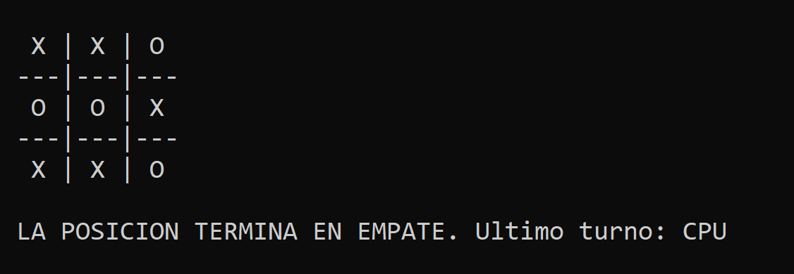
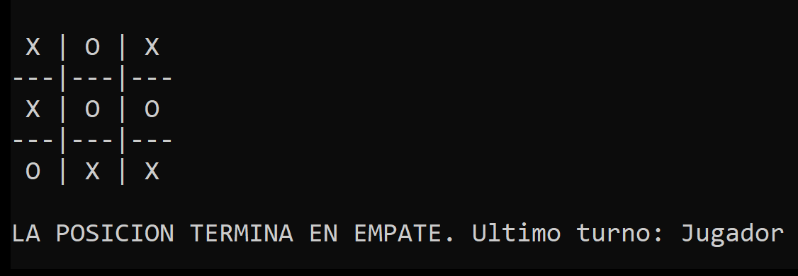
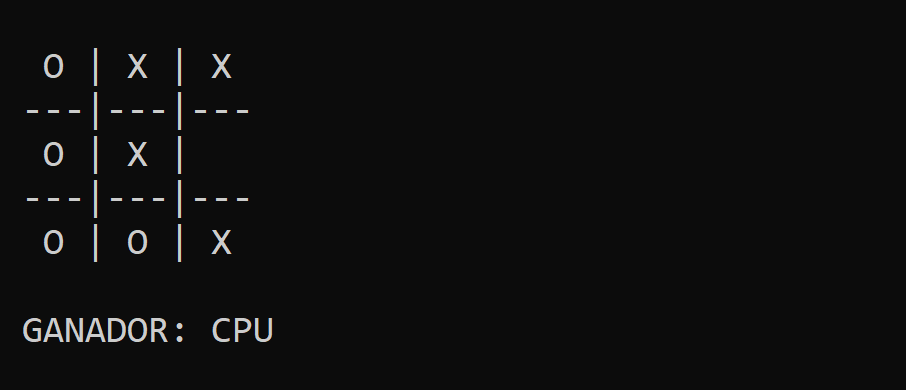

# TaTeTi - Minimax
## Introducción
Este programa emula el juego de Tres en raya (o TaTeTi) con el algoritmo `Minimax`.
El TaTeTi es un juego entre dos jugadores que consiste en colocar tres fichas en línea antes que el rival.

## Reglas
Los jugadores se turnan para colocar una ficha en un tablero de 3x3 celdas. El primer jugador en lograr tres fichas consecutivas (vertical, horizontal o diagonal) gana. En caso de que ningún jugador logre tres fichas consecutivas, la partida termina en empate.

## Estructura del código
El programa permite al usuario elegir el valor de ficha con el que jugará; el valor de ficha restante será asignado al programa.
  
Para insertar una ficha, el programa emplea el algoritmo `Minimax`, el cual evalua las siguientes posiciones a futuro posibles y, dependiendo el estado final de estas, devuelven un valor (0 si la posición termina en empate, 1 si la posición es ganadora para el programa, y -1 si la posición es ganadora para el jugador).

El algoritmo `Minimax` evalua la posición dependiendo el turno actual. 
- En caso de que el turno sea del programa, busca lograr que la posición sea ganadora para el programa.
- En caso de que el turno sea del jugador, busca lograr que la posición sea ganadora para el jugador.

En caso de que no logre conseguir una posición ganadora, busca que la posición termine en empate.

